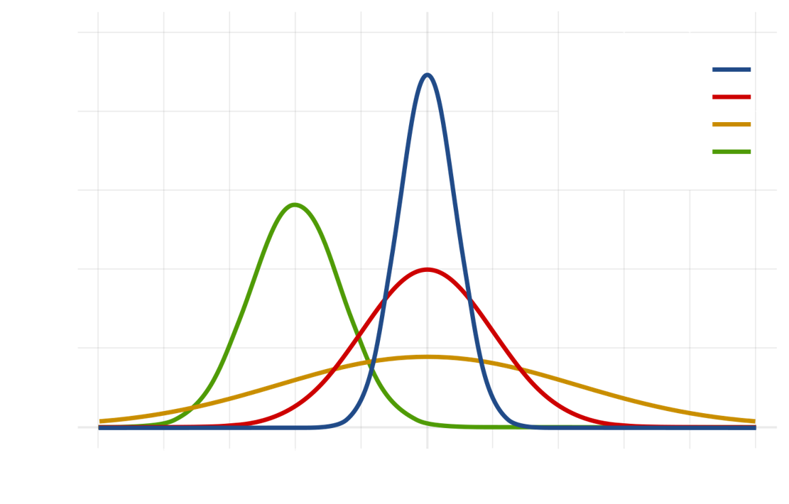

#### Class #3

##### Bioinformática Prática 2023

©Francisco Pina Martins 2017-2023

---

### Statistical Concepts Revisited

---

### Variables

|||

### Continuous

* Can assume an infinite number of values (eg. length) <!-- .element: class="fragment" data-fragment-index="1" -->

 <!-- .element: class="fragment" data-fragment-index="2" -->

|||

### Discrete
 
* Can assume a finite number of values (eg. number of beans) <!-- .element: class="fragment" data-fragment-index="1" -->

 <!-- .element: class="fragment" data-fragment-index="2" -->

---

### Measurement types

|||

### Nominal

* Discrete, unordered categories (eg. names) <!-- .element: class="fragment" data-fragment-index="1" -->

|||

### Ordinal (ranked)

* Discrete, ordered categories, of unknown exact values (eg. cancer stages) <!-- .element: class="fragment" data-fragment-index="1" -->

|||

### Circular

* The lowest and highest value are next to each other (eg. days of the year) <!-- .element: class="fragment" data-fragment-index="1" -->

|||

### Ratios

* Ratios of two measurement variables (eg. head size/body size) <!-- .element: class="fragment" data-fragment-index="1" -->

---

### Dependent & independent variables

* &shy;<!-- .element: class="fragment" -->Independent variables
  * &shy;<!-- .element: class="fragment" -->May cause change in dependent variables
* &shy;<!-- .element: class="fragment" -->Dependent variables
  * &shy;<!-- .element: class="fragment" -->Affected by changes in another variable

|||

### Which is which?

* Associating soil nitrogen content with dandelions density <!-- .element: class="fragment" data-fragment-index="1" -->
  * Nitrogen content might affect where dandelion plants live <!-- .element: class="fragment" data-fragment-index="2" -->
  * Dandelions deplete the soil of nitrogen content <!-- .element: class="fragment" data-fragment-index="3" -->
* Which is which? <!-- .element: class="fragment" data-fragment-index="4" -->

---

### [Would you like to know more?](http://www.biostathandbook.com/variabletypes.html)

---

### Accuracy & Precision

1. Random error <!-- .element: class="fragment" data-fragment-index="1" -->
2. Systematic error <!-- .element: class="fragment" data-fragment-index="2" -->
3. Perfect world <!-- .element: class="fragment" data-fragment-index="3" -->

---

### Populations & Samples

---

### Population

 <!-- .element: class="fragment" data-fragment-index="1" -->

* All possible observations <!-- .element: class="fragment" data-fragment-index="2" -->

|||

### Sample 

* Set of observations <!-- .element: class="fragment" data-fragment-index="1" -->

 <!-- .element: class="fragment" data-fragment-index="2" -->

* Sampling method  <!-- .element: class="fragment" data-fragment-index="3" -->
* Sample size "N" <!-- .element: class="fragment" data-fragment-index="4" -->

|||

### Parameters

 <!-- .element: class="fragment" data-fragment-index="1" -->

* Hair colour <!-- .element: class="fragment" data-fragment-index="2" -->

|||

### Parameters

* Missing data

 <!-- .element: class="fragment" data-fragment-index="1" -->

---

### Descriptive statistics

* Central tendency <!-- .element: class="fragment" data-fragment-index="1" -->
* Dispersal <!-- .element: class="fragment" data-fragment-index="2" -->

---

### Central tendency

* Mean - Average of all values <!-- .element: class="fragment" data-fragment-index="1" -->
  * Arithmetic <!-- .element: class="fragment" data-fragment-index="2" -->
  * Geometric <!-- .element: class="fragment" data-fragment-index="2" -->
  * Harmonic <!-- .element: class="fragment" data-fragment-index="2" -->
  * Weighted or unweighted <!-- .element: class="fragment" data-fragment-index="3" -->
* Median - Central occurrence <!-- .element: class="fragment" data-fragment-index="4" -->
* Mode - Most frequent occurrence <!-- .element: class="fragment" data-fragment-index="5" -->

|||

### Central tendency

---

### Dispersal

* &shy;<!-- .element: class="fragment" -->Range - Diff. between Max. and Min.
* &shy;<!-- .element: class="fragment" -->Variance - [Expectation of the squared deviation of a random variable from its mean](https://www.mathsisfun.com/data/standard-deviation.html)
* &shy;<!-- .element: class="fragment" -->Standard deviation (σ) - [Square root of variance](https://www.mathsisfun.com/data/standard-deviation-formulas.html)
* &shy;<!-- .element: class="fragment" -->Coefficient of variation - Ratio of Std. Dev. to the mean
* &shy;<!-- .element: class="fragment" -->Standard error - Std. Dev. of the sampling distribution

|||

### Dispersal

* Avg. = 1 and σ = 0.2 <!-- .element: class="fragment" data-fragment-index="1" -->
* 68% (0.8 - 1.2); 95% (0.6 - 1.4) <!-- .element: class="fragment" data-fragment-index="2" -->

---

### Reporting descriptive statistics

* Use a central tendency measurement coupled with a dispersal measurement <!-- .element: class="fragment" data-fragment-index="1" -->
  * Mean + Std. Dev. <!-- .element: class="fragment" data-fragment-index="2" -->
  * Median + range <!-- .element: class="fragment" data-fragment-index="2" -->
* Always remember: <!-- .element: class="fragment" data-fragment-index="3" -->
  * Present the value of "N" <!-- .element: class="fragment" data-fragment-index="4" -->
  * Indicate the units!!!!111!one! <!-- .element: class="fragment" data-fragment-index="4" -->

---

### Descriptive stats can be deceiving!

 <!-- .element: class="fragment" -->

All these datsets have:

|          | X    | Y     |
|----------|:----:|:-----:|
| Mean     | 9    | 7.50  |
| Var      | 11   | 4.125 |
| R²       | 0.67         |

---

### Other descriptors

* &shy;<!-- .element: class="fragment" -->*q*-Quantiles - Divide the data into *q* subsets of equal size
  * &shy;<!-- .element: class="fragment" -->Quartiles - Divide the data in 4 equal parts
  * &shy;<!-- .element: class="fragment" -->Percentiles - Divide the data into 100 equal parts

---

### Skewness & Kurtosis

 <!-- .element: class="fragment" data-fragment-index="1" -->

---

### Distribution examples

---

### Normal

|||

### Gaussian

|||

### Exponential

|||

### Poisson

|||

### Lognormal

|||

### Beta

|||

### Gamma

|||

### "Paranormal distribution"

---

### Data transformations

* Logaritmic <!-- .element: class="fragment" data-fragment-index="1" -->
* Square root <!-- .element: class="fragment" data-fragment-index="2" -->
* Arcsin <!-- .element: class="fragment" data-fragment-index="3" -->

---

### That's it for today!

---

### References

* [Biostats Handbook](http://www.biostathandbook.com/)
* [Dispersal measurements formulas](https://www.mathsisfun.com/data/standard-deviation-formulas.html)
* [Data transformations](https://sethroberts.net/2010/03/30/andrew-gelmans-top-statistical-tip/)
