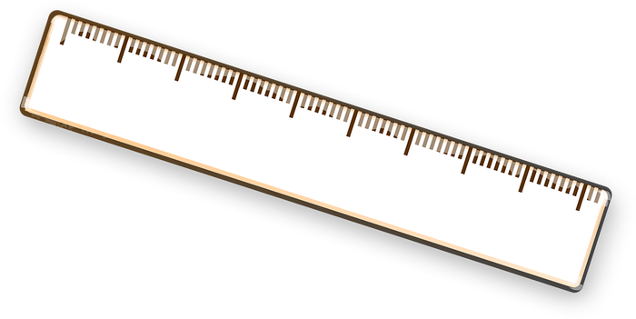

### Class #7

#### Bioinformática Prática 2023


Francisco Pina Martins

©Francisco Pina Martins 2017-2023

---

## Exploratory data analysis

---

### Measuring distance

* &shy;<!-- .element: class="fragment" data-fragment-index="1"-->Exploratory analyses are about this
* &shy;<!-- .element: class="fragment" data-fragment-index="2"-->Samples have lots of traits
  * &shy;<!-- .element: class="fragment" data-fragment-index="3"-->How far apart are they?
* &shy;<!-- .element: class="fragment" data-fragment-index="4"-->Let's start simple

&shy;<!-- .element: class="fragment" data-fragment-index="5"-->

|||

### Measuring distance

```R
set.seed(123)
scatter_data = data.frame(x=sample(1:10000, 7), 
                         y=sample(1:10000, 7))

plot(x=scatter_data[,"x"], y=scatter_data[,"y"], col=1:7, pch=19)

legend("topleft",
       legend = c(row.names(scatter_data)),
       pch = 19,
       col = c(1:7))
```

|||

### Measuring distance

Euclidean distances!

 

<div class="fragment">

```R
sqrt(sum((p - q)^2))
```

</div>
<div class="fragment">

```R
euclidean_distance = function(p, q){

    result = sqrt(sum((p - q)^2))

    return(result)
}
```

</div>
<div class="fragment">

```R
euclidean_distance(c(1,1), c(0,0))

euclidean_distance(scatter_data[1,], scatter_data[2,])  # Try other coords!
```

</div>

---

### Clustering analysis

---

### Main questions

* What is it?
* When is it useful? <!-- .element: class="fragment" data-fragment-index="1" -->
* How does it 'work'? <!-- .element: class="fragment" data-fragment-index="2" -->

---

### What is clustering analysis?

* A way to group objects
* Objects in the same group are closer to each other than to objects in other groups <!-- .element: class="fragment" data-fragment-index="1" -->
* It is not an algorithm, but rather a task (yes, it is that broad) <!-- .element: class="fragment" data-fragment-index="2" -->

 <!-- .element: class="fragment" data-fragment-index="3" -->

---

### When is clustering analysis useful?

* To group data into clusters
* For easy visualization of (di)similarities <!-- .element: class="fragment" data-fragment-index="1" -->
* As a starting point for other analyses <!-- .element: class="fragment" data-fragment-index="2" -->

---

## Dendrogram analysis

---

### How does it work?

* First a distance matrix must be obtained
	* More specifically - a triangular distance matrix <!-- .element: class="fragment" data-fragment-index="1" -->
* Then the distances are converted into a dendrogram <!-- .element: class="fragment" data-fragment-index="2" -->
	* Displays the distance between the objects in a graphical manner <!-- .element: class="fragment" data-fragment-index="3" -->
* Exploratory technique! <!-- .element: class="fragment" data-fragment-index="4" -->

[Know more](https://davetang.org/muse/2013/08/15/distance-matrix-computation/) <!-- .element: class="fragment" data-fragment-index="5" -->

|||

### A simple example

```R
triang = dist(scatter_data)
# dist() can use the following methods: "euclidean" (default), "maximum", "manhattan", "canberra", "binary" or "minkowski"

clustered_data = hclust(triang, method="complete")

plot(clustered_data)
```

---

### A worked example

* Suppose we have some students and their respective grades
* We need to quickly view if they can be clustered by grades <!-- .element: class="fragment" data-fragment-index="1" -->

|||

### Showtime!

Let's try to group some students

```R
students = ("
Name Maths English PE Science
Bart_Simpson 4 3 2 4
Lisa_Simpson 19 18 13 18
Tom_Sawyer 5 7 16 3
Huckleberry_Finn 5 2 17 1
Hermione_Granger 20 20 11 17
Harry_Potter 12 13 13 10
Samwell_Tarly 19 20 8 20
Alladin 10 10 20 2
Peter_Quill 8 6 17 3
Leia_Organa 18 18 15 19
Luke_Skywalker 13 12 18 16
")

student_matrix = as.matrix(read.table(textConnection(students),
                           header=TRUE,
                           row.names=1))

triang_students = dist(student_matrix)
students_cluster = hclust(triang_students ,method="average")
plot(students_cluster)

# Alternative:
plot(hclust(dist(student_matrix),method="average"))
```

---

## Exploratory data analysis

### PCA <!-- .element: class="fragment" data-fragment-index="1" -->

---

### Main questions

* What is it?
* When is it useful? <!-- .element: class="fragment" data-fragment-index="1" -->
* How does it 'work'? <!-- .element: class="fragment" data-fragment-index="2" -->

---

### What is a PCA?

* "**P**rincipal **C**omponent **A**nalysis"
* An exploratory method <!-- .element: class="fragment" data-fragment-index="1" -->
* A dimensional reduction technique <!-- .element: class="fragment" data-fragment-index="2" -->
* A way to cluster data from large, complex, datasets <!-- .element: class="fragment" data-fragment-index="3" -->

---

### When is a PCA useful?

* If data simplification is required
* If variables are highly correlated <!-- .element: class="fragment" data-fragment-index="1" -->
* If dealing with 3 dimensional or higher data <!-- .element: class="fragment" data-fragment-index="2" -->

---

### How does a PCA 'work'?

* Uses orthogonal transformation
* Converts possibly correlated variables into uncorrelated <!-- .element: class="fragment" data-fragment-index="1" -->
* The new variables are called "principal components" (PCs) <!-- .element: class="fragment" data-fragment-index="2" -->
* The PCs are sorted by the amount of variability they explain <!-- .element: class="fragment" data-fragment-index="3" -->

[Would you like to know more?](https://tgmstat.wordpress.com/2013/11/21/introduction-to-principal-component-analysis-pca/) <!-- .element: class="fragment" data-fragment-index="4" -->

---

### Improved showtime

* Let's get back to our students' example:
  * We need to group students based on their grades <!-- .element: class="fragment" data-fragment-index="1" -->

|||

### Showtime!

Get the data and take a look at it.

```R
student_df = read.csv("https://stuntspt.gitlab.io/bp2023/classes/C07_assets/students.csv",
                      header=TRUE,
                      row.names=1,
                      sep=";")
View(student_df)
```

|||

### Showtime!

Using the "Universe" as the discriminant

```R
# Calculate the PCA
studentPCA = prcomp(student_df[,1:4])  # Why not the entire DF?

# Define colours for the "Universe" grouping
my_categories = unique(student_df[,"Universe"])
universe_colours = as.numeric(factor(student_df[,"Universe"],
                                     levels=my_categories))

# Draw the plot
plot(studentPCA$x[,1:2], main="PCA student plot", col=universe_colours)

# Optionally label each point
text(studentPCA$x[,1], studentPCA$x[,2], rownames(student_df), pos= 3 )

# Draw a nice looking legend
legend("topright", legend=my_categories, pch = 1,
       col=unique(universe_colours))
```

|||

### Showtime!

Using the "Category" as the discriminant

```R
# Next, do the same, but for another discriminant
my_categories = unique(student_df[,"Category"])
category_colours = as.numeric(factor(student_df[,"Category"],
                                     levels=my_categories))

plot(studentPCA$x[,1:2], main="PCA student plot", col=category_colours)
text(studentPCA$x[,1], studentPCA$x[,2], rownames(student_df), pos= 3 )

legend("topright", legend=my_categories, pch = 1,
       col=unique(category_colours))
```

---

### Let's scale things up...

```R
# Get some data
wine <- read.csv("http://archive.ics.uci.edu/ml/machine-learning-databases/wine/wine.data", sep=",")

# Add column names
colnames(wine) <- c("Cultivar", "Alcohol", "Malic acid", "Ash",
                    "Alcalinity of ash", "Magnesium", "Total phenols",
                    "Flavanoids", "Nonflavanoid phenols", "Proanthocyanins",
                    "Color intensity", "Hue", "OD280/OD315 of diluted wines",
                    "Proline")

# The first column corresponds to the cultivar class
cultivar_classes <- factor(wine$Cultivar)

winePCA <- prcomp(scale(wine[, -1]))  # Note the `scale()` function
plot(winePCA$x[, 1:2], col = cultivar_classes, main="PCA test plot")
legend("bottomright", legend = c("Cv1", "Cv2", "Cv3"), pch = 1,
       col = c("black", "red", "green"))
```

---

### PCAs can take us further, but not in "plain" R

#### Introducing <!-- .element: class="fragment" data-fragment-index="1" --> 

[BioConductor](https://bioconductor.org/) <!-- .element: class="fragment" data-fragment-index="1" -->

|||

### When "vanilla" R just isn't enough

* &shy;<!-- .element: class="fragment" -->One of the good things about R is it's expandability
* &shy;<!-- .element: class="fragment" -->It is possible to "import" thousands of external 3rd party packages
* &shy;<!-- .element: class="fragment" -->Bioconductor is more than just a package. It's a 3rd party package repository
  * &shy;<!-- .element: class="fragment" -->It hosts ~~1473~~ ~~1649~~ ~~1823~~ ~~1974~~ ~~2042~~ 2143 bioinformatics related packages (at the time of writing)
  * &shy;<!-- .element: class="fragment" -->It is very easy to use directly from R

---

### Trying out "pcaMethods" package

* Easy to use PCA extensions
* First we import the new package

```R
install.packages("BiocManager")
BiocManager::install("pcaMethods")
library(pcaMethods)
```

|||

### Trying out "pcaMethods" package

Next we calculate the PCA and plot it

```R
# Calculate PCA
winePCAmethods = pca(wine[,-1], scale="vector", center=T, nPcs=2, method="svd")

# Plot it
slplot(winePCAmethods,
       scol=cultivar_classes,
       scoresLoadings=c(TRUE,FALSE))

legend("bottomright", legend = c("Cv1", "Cv2", "Cv3"), pch = 1,
       col = c("black", "red", "green"))

slplot(winePCAmethods,
       scoresLoadings=c(FALSE,TRUE))
```

|||

### Trying out "pcaMethods" package

Let's squeeze a little more information

```R
str(winePCAmethods) # slots are marked with @
winePCAmethods@R2
```

[Source](https://www.r-bloggers.com/principal-component-analysis-in-r/)

|||

### Still skeptic?

Let's test it!

```R
shapiro.test(wine$Ash[wine$Cultivar == "1"])
shapiro.test(wine$Ash[wine$Cultivar == "2"])
shapiro.test(wine$Ash[wine$Cultivar == "3"])

t.test(x=wine$Ash[wine$Cultivar == "2"], y=wine$Ash[wine$Cultivar == "3"])
t.test(x=wine$Ash[wine$Cultivar == "2"], y=wine$Ash[wine$Cultivar == "1"])

# What about this one?
t.test(x=wine$Ash[wine$Cultivar == "3"], y=wine$Ash[wine$Cultivar == "1"])
```

---

### References

* [Computing distance matrices](https://davetang.org/muse/2013/08/15/distance-matrix-computation/)
* [A short intro to PCA](https://tgmstat.wordpress.com/2013/11/21/introduction-to-principal-component-analysis-pca/)
